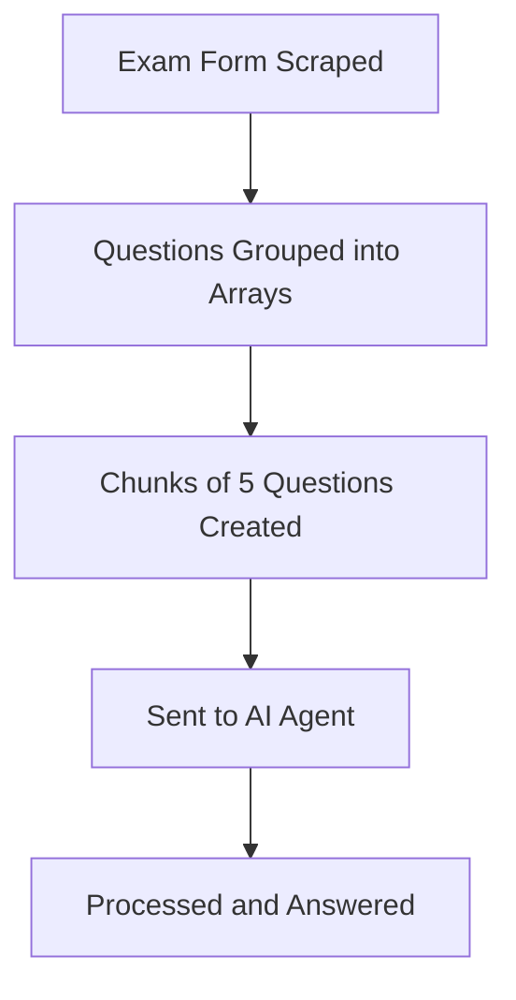

# Getting Started with Zolve

## Introduction

Welcome to **Zolve**, your AI assistant designed to help you solve online exams effortlessly. Zolve leverages a custom AI agent (**ZolveAI**) built on the **Google Flash 2.0 Model** to ensure high accuracy and efficiency.

## See How It Works

<video controls width="100%">
  <source src="/zolve.mp4" type="video/mp4" />
  Your browser does not support the video tag.
</video>

## Version History

### Version 1.0 (Deprecated)
The first version of Zolve required manual configuration by the user. However, with the introduction of **OpenRouter**, which provides free access to **LLMs**, we decided to develop our own AI agent to automate exam-solving. 

### Version 2.0 (Current)
Version 2.0 introduces a **new architecture** that will serve as the foundation for future updates. Despite this upgrade, we continue to support legacy agents such as **Claude** and **Cloudflare Workers**.

## How It Works

Zolve follows a structured process to efficiently solve online exams:

### Step-by-Step Breakdown
1. **Scraping**: The content script extracts the exam form from supported platforms.
2. **Grouping**: Questions are grouped into an array for processing.
3. **Chunking**: The grouped questions are sent in **batches of 5** for optimal performance.
4. **Processing**: The AI agent processes each batch and returns the answers.

> **Why batches of 5?** Sending questions in smaller chunks improves accuracy and response time by reducing token overload.

## Supported Platforms
Zolve currently supports: [Microsoft Forms](https://forms.microsoft.com)
